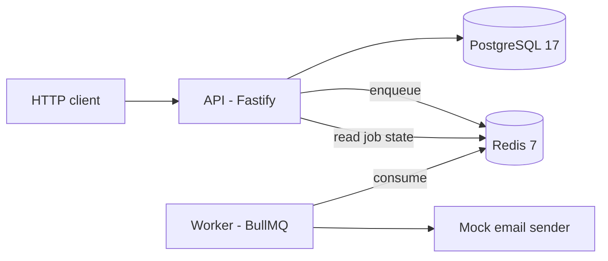
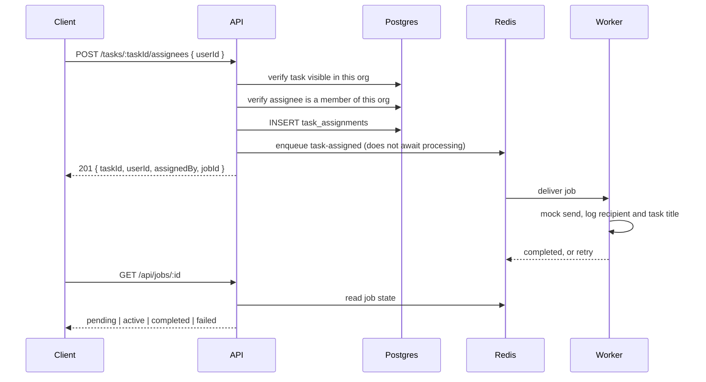
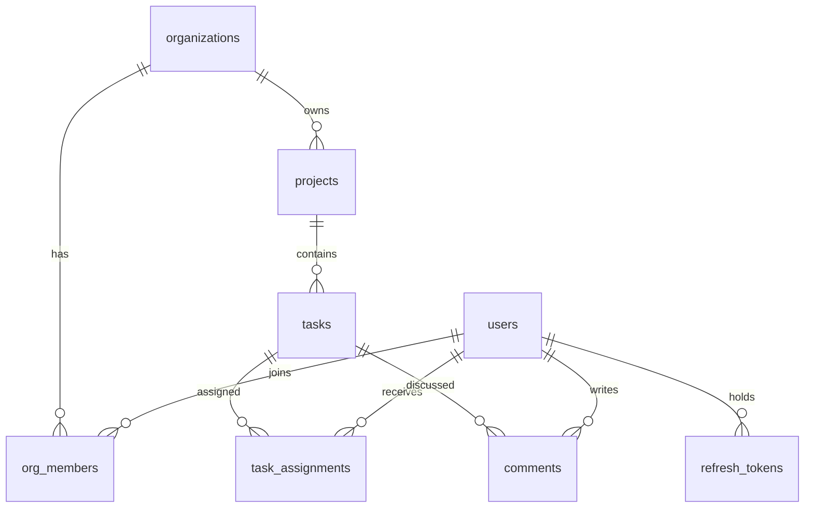

# TaskFlow architecture

## Components



Four processes, two of them stateful stores:

- **API** (`src/server.ts`) owns all HTTP handling, validation, authentication, tenant scoping, and
  every database write. It is the only process that talks to Postgres in normal operation.
- **Worker** (`src/worker.ts`) consumes the `email` queue and performs the mock send. It needs nothing
  from the database: job payloads are self-contained by design, so a notification never depends on a
  row still existing when it is delivered.
- **PostgreSQL** holds all durable state.
- **Redis** holds queue state only. Losing it costs pending notifications, not application data.

The two application processes share one image and one config module, differing only in their command.

## Request lifecycle

```
route (Zod validates params, query, body)
  -> onRequest: authenticate      verifies the bearer token, sets request.user
  -> preHandler: requireOrgMember looks up org_members, sets request.org = { id, role }
  -> preHandler: requireOrgAdmin  only on admin-only routes
  -> controller                   translates HTTP to a service call
  -> service                      all logic, all queries filtered by the verified orgId
  -> Prisma
```

Authentication runs at `onRequest`, before schema validation, so an anonymous caller gets 401 rather
than a 400 that would leak whether a route or id format exists.

Org-scoped routes are registered inside a child plugin mounted at `/:orgId` which installs
`requireOrgMember` as a scope-level hook. A route added inside that scope inherits the guard and cannot
omit it. This was not a stylistic choice: a review demonstrated that a route registered with only the
authentication guard returned another tenant's row with a 200.

## Assignment flow



The response does not wait for delivery. If the enqueue itself fails, the assignment still returns 201
with `jobId: null` — a queue outage must not block work assignment.

## Data model

Eight tables. `users` and `organizations` join through `org_members`, which carries the role and is the
single source of truth for tenant membership. `projects` belong to an organization; `tasks` belong to a
project and also carry `org_id` directly so tenant filtering never needs a join. `task_assignments` and
`comments` hang off tasks. `refresh_tokens` stores hashed sessions per user.



Status and priority are native Postgres enums (`todo/in_progress/review/done`,
`low/medium/high/urgent`) rather than check constraints or strings, so invalid values are rejected by
the database as well as by Zod.

### Indexes

Each index exists for a query the API actually issues; the reasoning is recorded in the migration SQL
next to each one.

| Index | Query it serves |
| :--- | :--- |
| `org_members(user_id)` | "Which orgs does this user belong to" — the first query of every authenticated request |
| `projects(org_id)` | Project listings, always org-scoped |
| `tasks(project_id, status)` | Board and list views filtered by status |
| `tasks(org_id, due_date)` | Org-wide due-date queries without a project join |
| `task_assignments(user_id)` | "My assigned tasks" |
| `comments(task_id)` | Comments fetched per task |
| `refresh_tokens(token_hash)` unique | Token lookup on refresh |

### Full-text search

`tasks.search_vector` is a `GENERATED ALWAYS ... STORED` tsvector combining title (weight A) and
description (weight B), backed by a GIN index. Because it is a generated column, it cannot drift from
the row it describes, and the application never maintains it. Search uses
`websearch_to_tsquery('english', ...)` with `ts_rank` ordering through a parameterized raw query — the
only raw SQL in the codebase.

## Failure behavior

**Redis is down.** Assignment still succeeds (201, `jobId: null`, row written); the failure is logged.
`GET /api/jobs/:id` answers 503 within about a second rather than hanging, because the queue read is
bounded — an unbounded read would hold the socket open indefinitely under ioredis's buffering.

**A job keeps failing.** BullMQ retries 3 times with exponential backoff (measured gaps: 1.00s, then
1.99s). After the final attempt the payload plus its failure reason is copied to the `email-dlq` queue.
Intermediate failures do not reach the dead-letter queue — the guard compares attempts made against the
configured maximum.

**Shutdown.** Both processes handle SIGTERM and SIGINT: the API closes the HTTP server, then the queue,
then the Prisma connection; the worker finishes its in-flight job before closing. Containers exit
promptly rather than being killed after Docker's timeout.

**Postgres is down.** Requests fail with 500 and the error envelope; no stack traces or driver messages
reach the client. The API does not attempt to serve stale data.

## Testing approach

Unit tests cover authentication logic, assignment validation, and the pagination helper against a real
database. Integration tests drive the assembled app through `app.inject()` — real routes, real guards,
real queries — against a dedicated test database, with tables truncated between tests and queue tests
isolated on Redis database index 1. Nothing first-party is mocked, and queue assertions read jobs back
off a real BullMQ queue rather than spying on a call.
